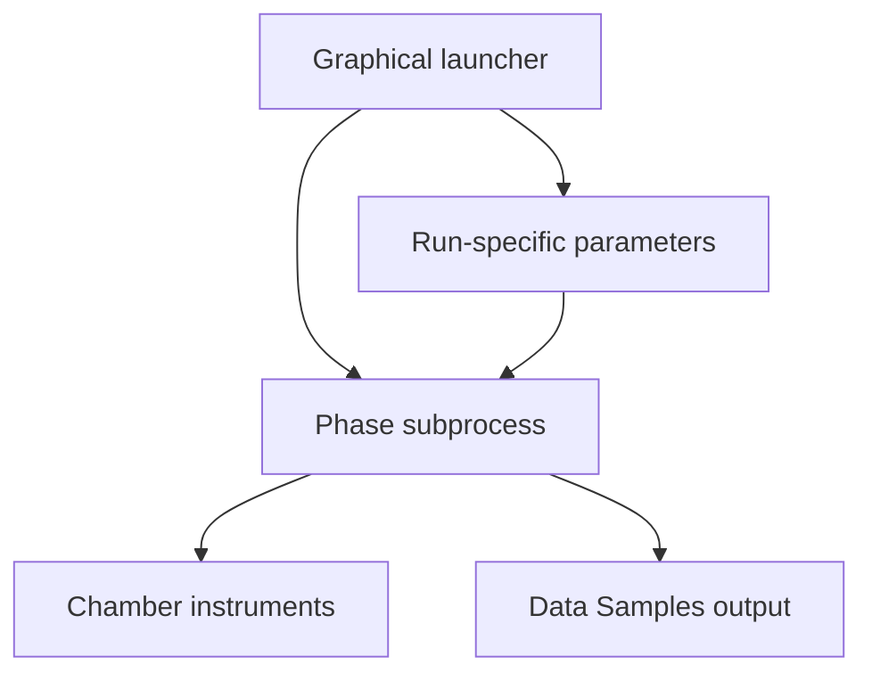

# NPG Chamber Control

Experimental-control software for a four-phase, ultra-high-vacuum workflow used to synthesize nanoporous graphene (NPG). The project combines instrument communication, operator-guided automation, live monitoring, data logging, safety-oriented shutdown paths, and a single graphical launcher.

The software was developed during a 2026 undergraduate internship in the Atomic Manipulation and Spectroscopy Group at ICN2. This repository is currently prepared as a **private technical archive**. Publication requires an institutional review and a separate public export; see [Publication checklist](docs/PUBLICATION_CHECKLIST.md).

## What the project demonstrates

- Python control of serial and UDP-connected laboratory equipment.
- Integration of four independent experimental phases in one launcher.
- Real-time plots, run-specific parameters, reusable automation modes, and structured output folders.
- Explicit phase handoff, COM-port release checks, watchdogs, and controlled abort behavior.
- Software regression testing without requiring access to the chamber hardware.
- Technical documentation and traceable evolution from early prototypes to release `0.9.18`.

## Workflow

| Phase | Purpose | Main integrations |
| --- | --- | --- |
| 01 — Heat up + Calibration | Heat and degas the molecular evaporator, then calibrate the QMB thickness ratio | QMBs, XGS600, oven PID, Keysight supply, CK-1 Arduino, pyrometer |
| 02 — Sputtering-Annealing | Prepare the Au/mica substrate through sputtering and annealing cycles | COSCON IS over UDP, XGS600, oven PID, operator-confirmed leak valve |
| 03 — DP-DBBA Evaporation | Deposit the molecular precursor with QMB and temperature feedback | QMBs, XGS600, oven PID, Keysight supply, CK-1 Arduino, pyrometer |
| 04 — NPG Annealings | Execute the staged thermal recipe and controlled electrical ramp-down | Oven PID, Keysight supply, CK-1 Arduino, pyrometer |



## Current release

The latest supported snapshot is `0.9.18`. The complete release history from `0.8.5` onward is recorded in [CHANGELOG.md](CHANGELOG.md). The [historical archive](history/README.md) now includes the March prototypes, sixteen recovered July project packages, the standalone COSCON and pyrometer diagnostics, and an explicit list of April–June files still awaiting recovery.

The authoritative runtime scripts are in `npg_chamber/legacy_scripts/`. Matching recovery copies are in `original_scripts_backup/`, and their SHA-256 hashes are recorded in `SOURCE_CODE_MANIFEST.json`.

## Installation

The chamber workstation is Windows-based and requires Python 3.10 or later.

```bat
python -m venv .venv
.venv\Scripts\activate
python -m pip install --upgrade pip
python -m pip install -e .
npg-chamber --version
```

For normal laboratory use, double-click `START_NPG_CHAMBER.bat`. The detailed operating instructions are in [READ ME.md](READ%20ME.md).

## Validation status

The codebase promoted to release `0.9.18` recorded 93 passing no-hardware regression tests on 21 July 2026. Those tests cover packaging, launcher behavior, parameter validation, serial handoff, pyrometer integration, COSCON dashboard logic, and source-manifest integrity. Hardware acceptance remains a separate supervised laboratory activity.

This is supervisory experimental-control software, not a safety PLC. It does not replace the chamber's hardware interlocks, equipment limits, risk assessment, or a trained operator. Read [Safety and validation](docs/SAFETY_AND_VALIDATION.md) before running any phase.

## Repository guide

- [Project history](docs/PROJECT_HISTORY.md)
- [Architecture](docs/ARCHITECTURE.md)
- [Safety and validation](docs/SAFETY_AND_VALIDATION.md)
- [Historical bug record](docs/BUG_HISTORY.md)
- [GitHub Desktop setup](docs/GITHUB_DESKTOP_SETUP.md)
- [Publication checklist](docs/PUBLICATION_CHECKLIST.md)
- [Excluded source material](docs/EXCLUDED_MATERIALS.md)
- [Citation metadata](CITATION.cff)

## Author

**Laura Rodríguez Jordán**  
GitHub: [@laurefisika](https://github.com/laurefisika)  
Contact: [laurarodriguezjordan2.0@gmail.com](mailto:laurarodriguezjordan2.0@gmail.com)

## License and publication status

The current license permits internal laboratory use and review only. Do not make this archive public or assign an open-source license until ownership, authorship, institutional approval, third-party material, network configuration, and hardware documentation have been reviewed.
