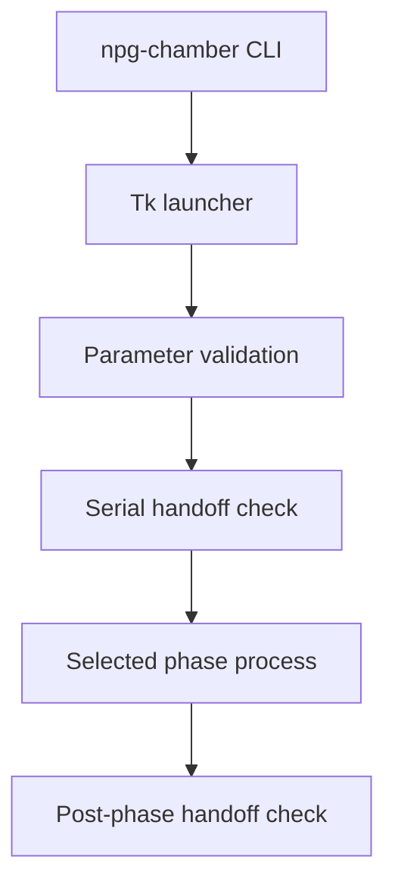

# Architecture

## Design approach

The project intentionally keeps the four experimental scripts independent. Each phase owns different equipment, transitions, and shutdown behavior, so the launcher starts it as a separate Python process rather than merging all experimental logic into one long-running process.

The package layer provides installation, navigation, parameter handoff, source verification, common device helpers, consistent data locations, and serial-port release checks. The phase scripts remain the authoritative implementations of the experimental sequences.

## Main components

| Path | Responsibility |
| --- | --- |
| `npg_chamber/gui_launcher.py` | Main GUI, run names, automation modes, parameter editor, phase sequencing |
| `npg_chamber/workflows/` | Small adapters that locate and execute the selected phase script |
| `npg_chamber/legacy_scripts/` | Authoritative phase implementations |
| `npg_chamber/common/serial_handoff.py` | Pre- and post-phase COM-port release verification |
| `npg_chamber/config/` | Ports, editable run parameters, automation modes, and pyrometer profiles |
| `npg_chamber/devices/` | Reusable communication helpers for individual instruments |
| `developer_tests/` | Regression tests designed to run without chamber hardware |
| `diagnostic_tools/` | Explicit manual connectivity checks |
| `original_scripts_backup/` | Recovery copies excluded from normal execution |

## Parameter flow

The launcher validates editable values and passes each phase a JSON payload through an environment variable. The child process records the complete effective startup recipe in its run folder. Source defaults are not rewritten, and hard current, voltage, communication, and safety limits are not part of the normal operator editor.

Persistent automation modes store reusable editable recipes in `Data Samples/Configuration/automation_modes.json`. Pyrometer profiles are stored separately in `Data Samples/Configuration/pyrometer_profiles.json`. Both paths are ignored by Git because they are local operator data.

## Data flow

Each phase writes to its own directory under `Data Samples/`. Run folders may contain CSV telemetry, summaries, effective parameter JSON, pyrometer profile data, and final plots. Generated experimental data are deliberately excluded from version control.

## Hardware boundaries

The software communicates with serial devices through `pyserial` and with COSCON IS through UDP on the vendor protocol port. The operator still performs physical actions such as checking the chamber, confirming shutter state, and opening or closing the manual Ar leak valve.

